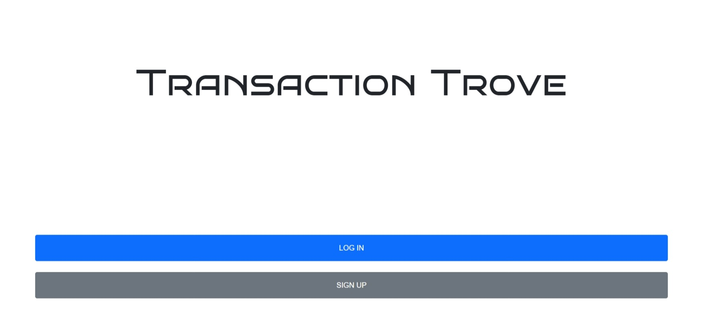
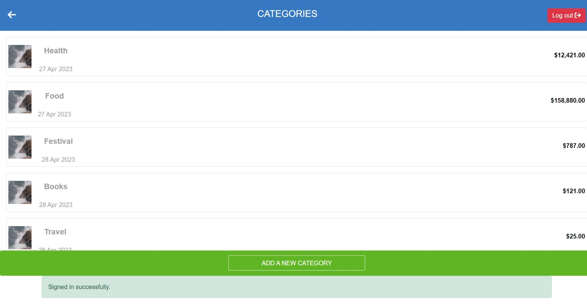
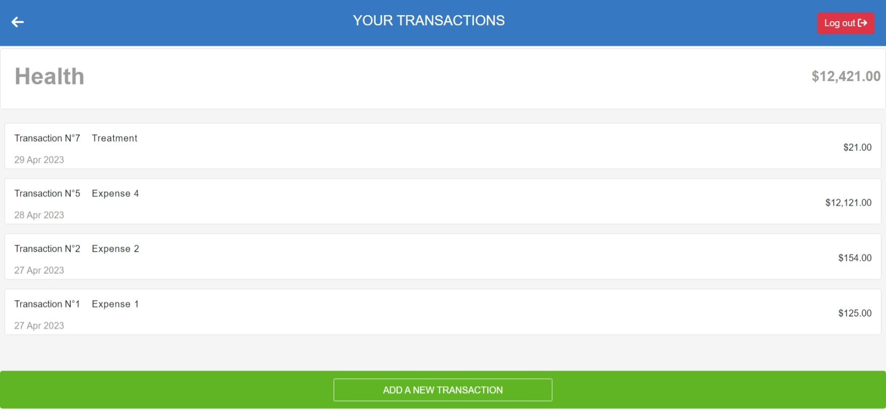
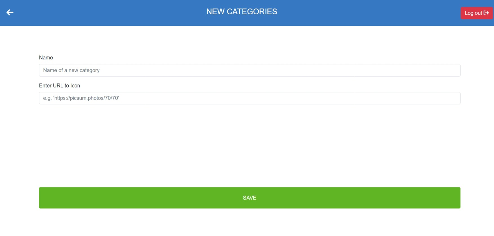
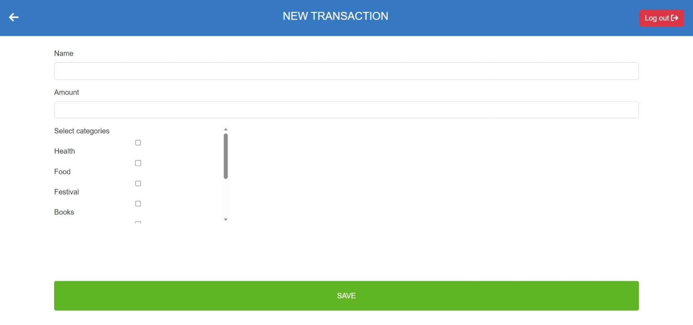

<a name="readme-top"></a>

<div align="center">

  
  <h1><b>Transaction Trove</b></h1>

</div>


<!-- TABLE OF CONTENTS -->

# 📗 Table of Contents

- [📖 About the Project](#about-project)
  - [🛠 Built With](#built-with)
    - [Key Features](#key-features)
    - [Live Demo](#live-demo)
- [💻 Getting Started](#getting-started)
  - [Setup](#setup)
  - [Prerequisites](#prerequisites)
  - [Install](#install)
  - [Usage](#usage)
  - [Run tests](#run-tests)
- [🖥 User Interface](#ui)
- [👥 Authors](#authors)
- [🔭 Future Features](#future-features)
- [🤝 Contributing](#contributing)
- [⭐️ Show your support](#support)
- [🙏 Acknowledgements](#acknowledgements)
- [📝 License](#license)

<!-- PROJECT DESCRIPTION -->

# 📖 Project Name

## Transaction Trove using Rails

## About this project

This is a budget storing app built with `Rails` framework to let users sign up, login, and add different categories to keep a track of their expenses and transaction. They can add transactions for different categories and have a look at their total spending. This app is useful when someone must keep track of their budget.

## 🛠 Built With <a name="built-with"></a>

- `Ruby`, `Ruby on Rails`, `JavaScript`, `HTML`, `CSS`

<!-- Features -->

### Key Features <a name="key-features"></a>

> Key features of the application.

- A full stack app where users can add their expenses and keep a track of their budget.
- Users can add categories of expenses and add transactions.
- Users will be able to authenticate their accounts.
- Users data is private to every user and none can access each others data.

<p align="right">(<a href="#readme-top">back to top</a>)</p>

<!-- LIVE DEMO -->

## 🚀 Live Demo <a name="live-demo"></a>

Live demo is currently not available due to restriction on free accounts of Render. Take a look at the UI of the website below.<br>
Presentation of the project is available [here](https://www.loom.com/share/ebe1e83172b648e38a0ab578e21444da).

<!-- GETTING STARTED -->

## 💻 Getting Started
To clone the repository in local environment try following steps.

### Prerequisites

- [x] A code editor like Visual Studio Code with Git and Node.js.

You can check if Git is installed by running the following command in the terminal.
```
$ git --version
```

Likewise for `Ruby` and `gem` for package installation.
```
$ ruby --version && gem --version
```
**Note: This project is built with `Ruby` version 3.1.3**
### Setup

Clone the repository using [this link](https://github.com/PrangonGhose/TransactionTrove).

### Install

In the terminal, go to your file directory and run this command.

```
$ git clone https://github.com/PrangonGhose/TransactionTrove
```
### Get into development

In the terminal, run these commands to get into development.
```
$ cd Rails-recipe

$ bundle init

$ bundle install (install dependencies)
```
**Note: You might need to update [database.yml](./config/database.yml) for development and testing environments with necessary username and password for your database in their respective positions. Because of free deployment, sending of user confirmation email option can take several hours to reach to the user mail box.**
```
$ rails db:create

$ rails db:migrate

$ rails server
```
### Usage <a href="usage" name="usage"></a>

This website is applicable for both mobile and desktop version.

### Run Test <a href="run-test" name="run-tests"></a>

```
$ rspec
```

<p align="right">(<a href="#readme-top">back to top</a>)</p>

## User Interface <a name="ui"></a>

| Index Page |
| ----- |
|  |

| Categories Page | Transactions Page |
| ------ | ------ |
|  |  |

| Add Category Page | Add Transaction Page |
| ----- | ----- |
|  |  |


<p align="right">(<a href="#readme-top">back to top</a>)</p>

<!-- AUTHORS -->

## 👥 Authors <a name="authors"></a>

👤 **Prangon Ghose**

- GitHub: [@PrangonGhose](https://github.com/PrangonGhose)
- LinkedIn: [Prangon Ghose](https://www.linkedin.com/in/prangon-ghose/)

<p align="right">(<a href="#readme-top">back to top</a>)</p>

## 🔭 Future Features <a name="future-features"></a>

- [ ] **Add animation to splash screen**
- [ ] **Enable users to delete categories and transactions**
- [ ] **Develop side menu for interacting with the website**

<p align="right">(<a href="#readme-top">back to top</a>)</p>

<!-- CONTRIBUTING -->

## 🤝 Contributing <a name="contributing"></a>

Contributions, issues, and feature requests are welcome! Add suggestions by opening new issues.

Feel free to check the [issues page](https://github.com/PrangonGhose/TransactionTrove/issues).

<p align="right">(<a href="#readme-top">back to top</a>)</p>

<!-- SUPPORT -->

## ⭐️ Show your support <a name="support"></a>

Give a ⭐️ if you like this project!

<p align="right">(<a href="#readme-top">back to top</a>)</p>

<!-- ACKNOWLEDGEMENTS -->

## 🙏 Acknowledgments <a name="acknowledgements"></a>

Authors would like to thank:
- [Gregoire Vella](https://www.behance.net/gregoirevella)
- [Microverse](https://www.microverse.org/)
- Code Reviewers
- Coding Partners

<p align="right">(<a href="#readme-top">back to top</a>)</p>

<!-- LICENSE -->

## 📝 License <a name="license"></a>

This project is [MIT](./LICENSE) licensed.
